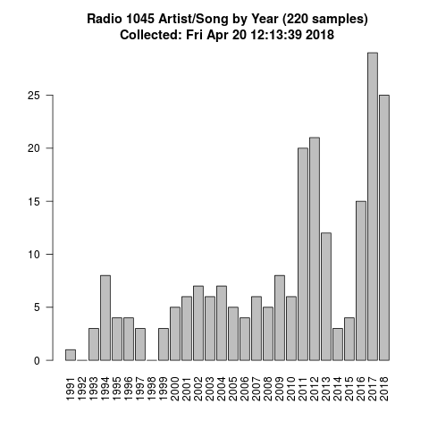
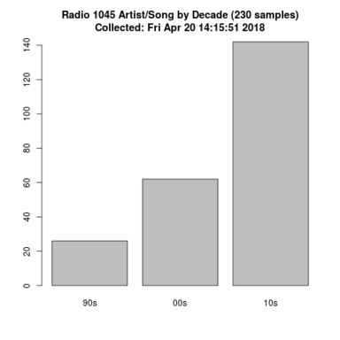

## Playlist Parser for Radio1045 (Philly area radio station)

Simple set of scripts that allows one to periodically pull down a radio station playlist, query information about the artist/songs on that playlist, and produce some aggregated information about the playlist over time.

A database (CSV file) of previously seen/queried entries is maintained which allows a larger history of songs to be maintained (the web interface only displays the last 10 songs) as well as a mechanism to reuse prior search results for repeated songs.

These scripts are built specifically for a Philadelphia area radio station (radio1045) but likely have a broader applicability to other iHeartRadio stations. 

#### Examples

The scripts output two files in the results directory every time they are run: a view per year and a view per decade.

#### Basic Process

- Pull down the most recent setlist
- Extract some metadata about the page (e.g. date)
- Iterate over the playlist embedded in the page
- For each song:
  - Check if there is a cached version in local DB
  - If not, query artist/song info from https://musicbrainz.org
  - Add new song/artist info to DB
- Any failures are appended to a failure log

#### Notes

While there are some portions of this code that attempt to do caching, error checking, and throttling the overall intent is not to build a 'product.' 

I built this as a weekend project to answer some questions I had about the type of songs being played on a local radio station. There is one monolithic script that shells-out to other utilities; a global array of arrays instead of proper use of classes; and other ugly parts that could use improvement. 

None of that is a focus at this point.

